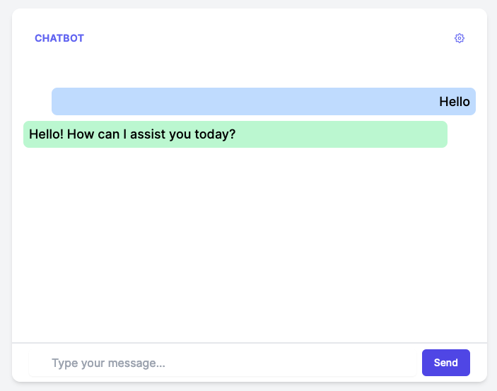

# Rivet NextJS Chatbot Starter

This project is a simpler starter project for a chatbot using [Rivet](https://rivet.ironcladapp.com) and [NextJS](https://nextjs.org/).



You can see a live demo of this project [here](https://rivet-nextjs-chatbot-starter.vercel.app/).

You can deploy this project to your own Vercel account right away!

[](https://vercel.com/new/clone?repository-url=https%3A%2F%2Fgithub.com%2Fabrenneke%2Frivet-nextjs-starter)

## OpenAI Api Key

By default, the project is configured to accept a client's API key in a Settings menu in the app. This way, your own API key is not used in the project. To use your own API key, you can set the `OPENAI_API_KEY` environment variable in your [Vercel project environment variables settings](https://vercel.com/docs/projects/environment-variables).

## Development

To run this project locally, run the following commands:

```bash
yarn
yarn dev
```

This will start up the NextJS development server on port 3000.

## App Structure

The frontend of this application uses [TailwindCSS](https://tailwindcss.com/) for styling. The app is structured as follows:

- `app/page.tsx` - The main page of the application. This is where the chatbot is rendered.
- `app/components` - The components used in the application. There are a handful of chat related components in here.
- `app/hooks` - Custom hooks used in the application, such as `useSubmitMessage` to submit a message to the API and stream the result back to the client.
- `app/api` - The API routes used in the application. There is one route for the chatbot to send messages to OpenAI (`/api/chat`).
- `app/state` - State managed by [Recoil](https://recoiljs.org/). There is a single atom for the client's API key.
- `app/utils` - Miscellaneous utilities used in the application.
